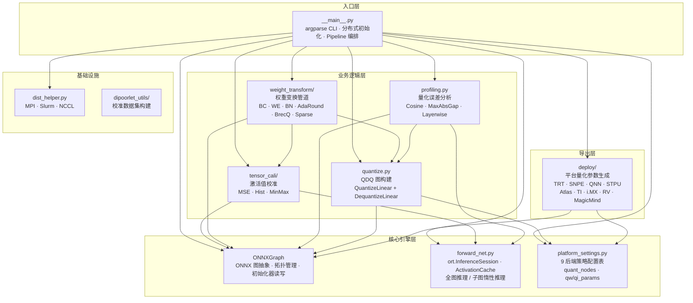
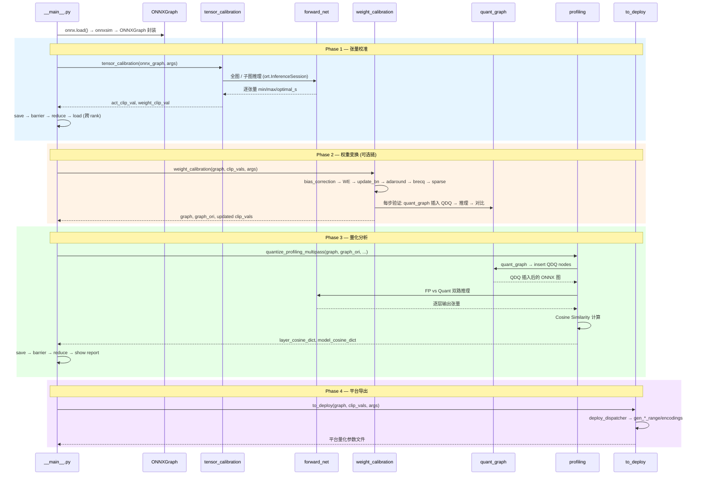
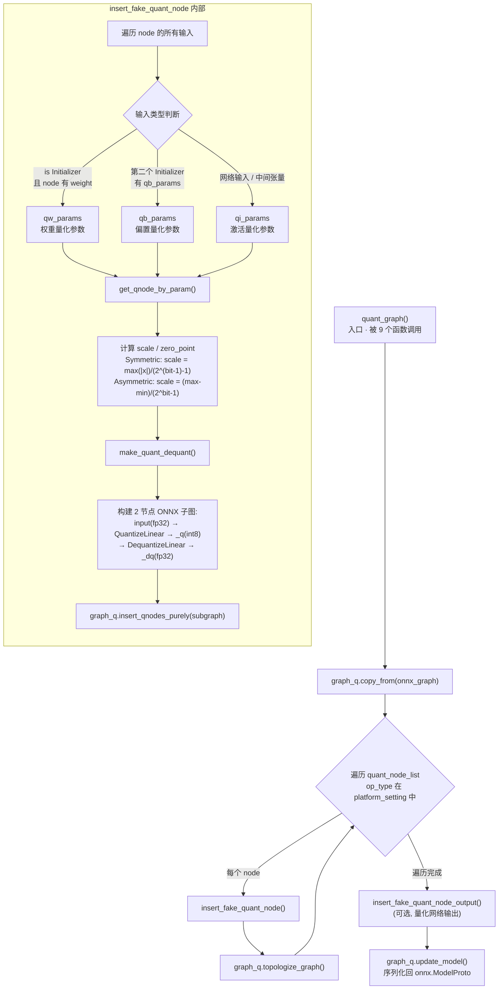
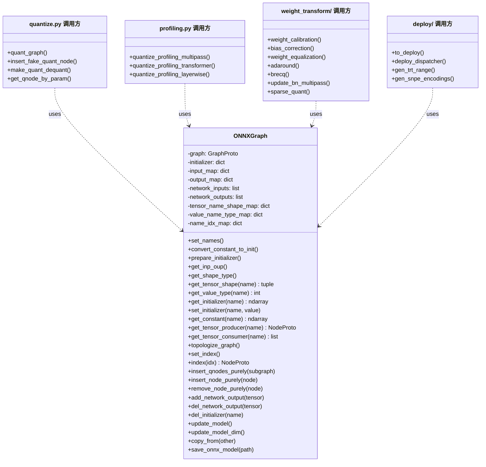
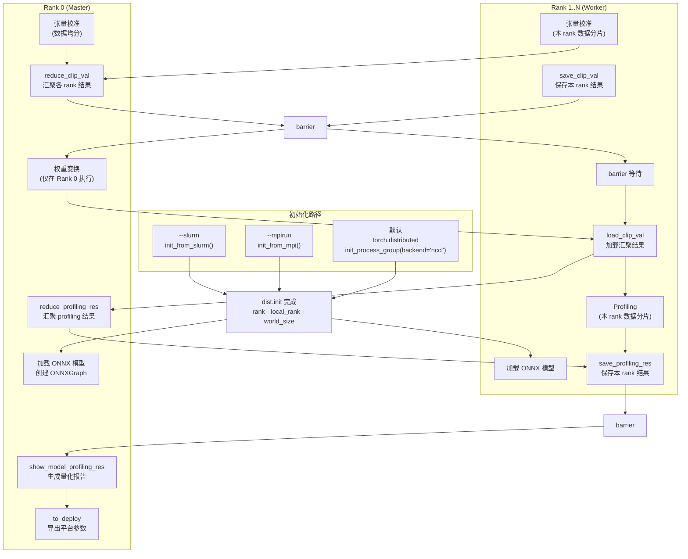

# Dipoorlet Architecture

> Generated from GitNexus knowledge graph — 2,425 symbols, 74 execution flows, 11 functional areas.

## Overview

Dipoorlet is an offline quantization tool for ONNX models. It takes a pre-trained ONNX model and a calibration dataset, then produces platform-specific quantization parameters (scale, zero_point, min/max ranges) for deployment to 9 inference engines.

**Key design**: Operates exclusively on the ONNX graph representation — no framework-native model objects. ONNX Runtime (CUDA) serves as the forward engine.

---

## 1. System Architecture



---

## 2. Pipeline Data Flow



---

## 3. QDQ Graph Construction (核心量化路径)



---

## 4. ONNXGraph — 中央数据结构



---

## 5. Weight Transform Pipeline

```mermaid
flowchart LR
    INPUT["ONNXGraph<br/>+ act_clip_val<br/>+ weight_clip_val"] --> WT["weight_calibration()"]

    WT --> BC{"--bc ?"}
    BC -->|Yes| BC_DO["bias_correction<br/>修正 Conv/Gemm bias<br/>吸收权重量化误差"]
    BC -->|No| WE{"--we ?"}
    BC_DO --> WE

    WE -->|Yes| WE_DO["weight_equalization<br/>跨层 SConv/SC 缩放<br/>均衡权重分布"]
    WE -->|No| BN{"--update_bn ?"}
    WE_DO --> BN

    BN -->|Yes| BN_DO["update_bn<br/>重算 BN running_mean/var<br/>基于校准数据集"]
    BN -->|No| ADA{"--adaround ?"}
    BN_DO --> ADA

    ADA -->|Yes| ADA_DO["adaround<br/>PyTorch 逐层重建<br/>Adam 优化 soft-rounding V<br/>5000 epochs"]
    ADA -->|No| BRE{"--brecq ?"}
    ADA_DO --> BRE

    BRE -->|Yes| BRE_DO["brecq / QDrop<br/>Block 重建量化<br/>--drop → 激活量化"]
    BRE -->|No| SP{"--sparse ?"}
    BRE_DO --> SP

    SP -->|Yes| SP_DO["sparse_quant<br/>N:M 结构化稀疏"]
    SP -->|No| OUTPUT
    SP_DO --> OUTPUT["更新后的 ONNXGraph<br/>+ 重新校准的 clip_vals"]

    style BC_DO fill:#e3f2fd
    style WE_DO fill:#fff3e0
    style BN_DO fill:#fce4ec
    style ADA_DO fill:#e8f5e9
    style BRE_DO fill:#f3e5f5
    style SP_DO fill:#e0f2f1
```



---

## 6. 分布式执行模型



---

## 7. Functional Areas (11 模块)

```mermaid
graph LR
    subgraph Core["核心 (55 symbols · 78% cohesion)"]
        direction TB
        C1["__main__.py · CLI 编排"]
        C2["utils.py · ONNXGraph"]
        C3["forward_net.py · 推理引擎"]
        C4["quantize.py · QDQ 图"]
        C5["profiling.py · 误差分析"]
        C6["platform_settings.py"]
    end

    subgraph WT_Mod["Weight Transform (42 symbols · 86%)"]
        direction TB
        W1["bias_correction.py"]
        W2["weight_equalization.py"]
        W3["update_bn.py"]
        W4["adaround.py"]
        W5["brecq.py"]
        W6["sparse_quant.py"]
    end

    subgraph Deploy_Mod["Deploy (24 symbols · 86%)"]
        direction TB
        D1["TRT · SNPE · QNN"]
        D2["STPU · Atlas · TI"]
        D3["i.MX · RV · MagicMind"]
    end

    subgraph Demos["DemoLab (7 实验套件)"]
        direction TB
        E1["MobileNetV2 + TRT"]
        E2["ResNet18 多后端"]
        E3["OD BEV + QNN"]
        E4["YOLOv8 + SNPE/QNN"]
    end

    Core --> WT_Mod
    Core --> Deploy_Mod
    WT_Mod --> Core
    Demos -.-> Core
    Demos -.-> WT_Mod
    Demos -.-> Deploy_Mod
```



---

## 8. Key Execution Flows

### Flow 1: 主量化分析 (5 steps · 遍历最频繁的路径)

```
quantize_profiling_multipass          dipoorlet/profiling.py
  → quant_graph                       dipoorlet/quantize.py
    → insert_fake_quant_node          dipoorlet/quantize.py
      → get_qnode_by_param            dipoorlet/quantize.py
        → make_quant_dequant          dipoorlet/quantize.py
```

### Flow 2: AdaRound 自适应舍入 (5 steps)

```
adaround                              dipoorlet/weight_transform/adaround.py
  → quant_graph                       dipoorlet/quantize.py
    → insert_fake_quant_node          dipoorlet/quantize.py
      → get_qnode_by_param            dipoorlet/quantize.py
        → make_quant_dequant          dipoorlet/quantize.py
```

### Flow 3: BrecQ / QDrop 块重建 (5 steps)

```
brecq                                 dipoorlet/weight_transform/brecq.py
  → quant_graph                       dipoorlet/quantize.py
    → insert_fake_quant_node          dipoorlet/quantize.py
      → get_qnode_by_param            dipoorlet/quantize.py
        → make_quant_dequant          dipoorlet/quantize.py
```

### Flow 4: 权重校准管道 (4 steps)

```
weight_calibration                    dipoorlet/weight_transform/weight_trans_base.py
  → bias_correction                   dipoorlet/weight_transform/bias_correction.py
    → quant_graph                     dipoorlet/quantize.py
      → copy_from                     dipoorlet/utils.py
```

### Flow 5: 部署导出

```
to_deploy                             dipoorlet/deploy/deploy_base.py
  → deploy_dispatcher                 dipoorlet/deploy/deploy_default.py
    → gen_trt_range / gen_snpe_encodings / gen_stpu_minmax / ...
```

---

## 9. 关键指标汇总

| 符号 | 被多少模块依赖 | 角色 |
|------|:---:|------|
| `ONNXGraph` | 13 | 中央图抽象 — 26 个方法 |
| `quant_graph` | 9 | QDQ 插入汇聚点 |
| `platform_setting_table` | 5+ | 9 后端策略配置 |
| `forward_net` 系列 | 4 | 推理引擎（全图 / 子图） |
| `dispatch_functool` | 3 | 算法 / 平台分派装饰器 |

## 10. 平台覆盖

| 平台 | 模块 | 目标硬件 |
|------|------|----------|
| `trt` | `deploy_trt.py` | NVIDIA GPU (TensorRT) |
| `snpe` | `deploy_snpe.py` | Qualcomm Snapdragon |
| `qnn` | `deploy_qnn.py` | Qualcomm AI Engine |
| `stpu` | `deploy_stpu.py` | Horizon Robotics Journey |
| `atlas` | `deploy_atlas.py` | Huawei Ascend |
| `ti` | `deploy_ti.py` | TI TDA4 automotive |
| `imx` | `deploy_imx.py` | NXP i.MX embedded |
| `rv` | `deploy_rv.py` | Rockchip (RV1126/RK3568) |
| `magicmind` | `deploy_magicmind.py` | Cambricon MLU |

## Tensor Calibration Algorithms

| Algorithm | Flag | Method | Description |
|-----------|------|--------|-------------|
| MSE | `-A mse` (default) | `find_clip_val_octav` | Iterative optimal clipping minimizing MSE |
| MinMax | `-A minmax` | `find_clip_val_minmax` | Simple min/max range across all samples |
| Histogram | `-A hist` | `find_clip_val_hist` | Histogram accumulation with `--threshold` cutoff |
