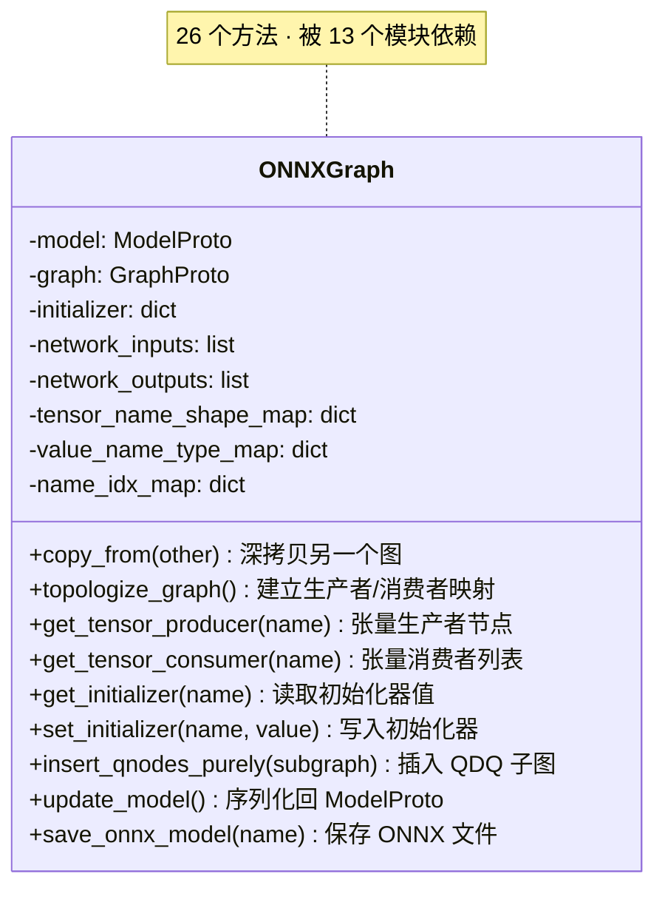
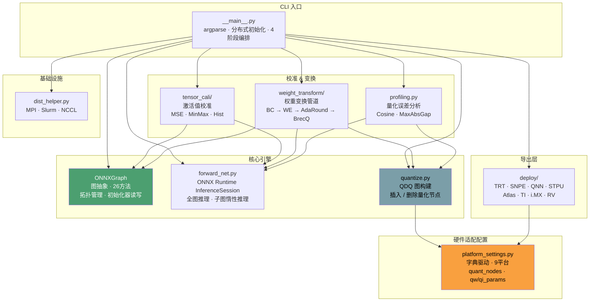

# Dipoorlet 架构详细分析

> 项目规模: ~50 文件 · 34 Python 模块 · 2,425 符号 · 74 执行流程 · 11 功能模块

## 1. 项目定位

Dipoorlet 是一个**轻量级 ONNX 离线量化工具**。它不修改模型的计算图结构，而是通过 ONNX Runtime 推理校准数据，生成每个张量的量化参数（scale / zero_point / min / max），然后导出为目标推理引擎可读取的配置文件。

**核心设计理念**：纯 ONNX 图操作 + 字典驱动的平台配置 + 参数生成型输出。

---

## 2. 目录结构

```
Dipoorlet/
├── dipoorlet/                  # 核心代码 (34 .py 文件)
│   ├── __main__.py             # CLI 入口，argparse + 分布式初始化 + 4阶段 Pipeline
│   ├── utils.py                # ONNXGraph 中央图数据结构 + 分布式工具
│   ├── forward_net.py          # ONNX Runtime 推理引擎 + ActivationCache
│   ├── quantize.py             # QDQ 图构建 (QuantizeLinear + DequantizeLinear 插入)
│   ├── platform_settings.py    # 9 平台配置字典 (硬件约束声明)
│   ├── profiling.py            # 量化误差分析 (Cosine / MaxAbsGap / Layerwise)
│   ├── dist_helper.py          # 分布式启动 (MPI / Slurm / NCCL)
│   │
│   ├── tensor_cali/            # 张量校准模块
│   │   ├── tensor_cali_base.py #   校准框架基类
│   │   └── basic_algorithm.py  #   MSE / MinMax / Histogram 算法
│   │
│   ├── weight_transform/       # 权重变换管道
│   │   ├── weight_trans_base.py#   管道编排
│   │   ├── bias_correction.py  #   偏置修正
│   │   ├── weight_equalization.py# 跨层权重均衡
│   │   ├── update_bn.py        #   BN running_mean/var 重算
│   │   ├── adaround.py         #   AdaRound 自适应舍入 (PyTorch)
│   │   ├── brecq.py            #   BrecQ / QDrop 块重建
│   │   └── sparse_quant.py     #   N:M 结构化稀疏
│   │
│   └── deploy/                 # 平台参数导出
│       ├── deploy_base.py      #   导出分发器
│       ├── deploy_default.py   #   默认导出
│       ├── deploy_trt.py       #   TensorRT 量化范围
│       ├── deploy_snpe.py      #   Qualcomm SNPE encodings
│       ├── deploy_qnn.py       #   Qualcomm QNN
│       ├── deploy_stpu.py      #   Horizon STPU min/max
│       ├── deploy_atlas.py     #   Huawei Ascend
│       ├── deploy_ti.py        #   TI TDA4
│       ├── deploy_imx.py       #   NXP i.MX
│       ├── deploy_rv.py        #   Rockchip
│       └── deploy_magicmind.py #   Cambricon MLU
│
├── dipoorlet_utils/            # 校准数据集构建工具
├── DemoLab/                    # 7 个端到端 Demo
└── docs/                       # 文档
```

---

## 3. 核心 4 阶段 Pipeline

```
ONNX Model + Calibration Data
    │
    ▼
┌─────────────────────────────────────────────────────────────┐
│ Phase 1: 张量校准 (tensor_calibration)                        │
│   ONNX Runtime 推理 → 收集每层激活值 min/max → 跨 rank 汇聚    │
│   算法: MSE (默认) / MinMax / Histogram                      │
│   产出: act_clip_val, weight_clip_val                        │
├─────────────────────────────────────────────────────────────┤
│ Phase 2: 权重变换 (weight_calibration) [可选链式执行]          │
│   bias_correction → weight_equalization → update_bn          │
│   → adaround → brecq → sparse                                │
│   每步: 插入 QDQ → 推理验证 → 对比精度                         │
│   产出: 更新后的 ONNXGraph + clip_vals                        │
├─────────────────────────────────────────────────────────────┤
│ Phase 3: 量化分析 (profiling)                                │
│   quant_graph → 插入 QDQ 节点 → FP vs Quant 双路推理          │
│   Cosine Similarity / MaxAbsGap 逐层计算                      │
│   产出: 逐层 + 整体精度报告                                    │
├─────────────────────────────────────────────────────────────┤
│ Phase 4: 平台导出 (deploy)                                   │
│   根据 platform_settings 生成目标格式的参数文件                 │
│   产出: TRT range / SNPE encodings / STPU minmax / ...        │
└─────────────────────────────────────────────────────────────┘
```

---

## 4. 中央数据结构：ONNXGraph



`ONNXGraph` 是整个框架的唯一图抽象，不依赖 PyTorch 模型对象，所有操作都在 ONNX 图级别完成。

---

## 5. 硬件适配机制：字典驱动的平台配置

Dipoorlet 最核心的设计——添加新平台**只需要一个 Python 字典**。

### 平台配置模板

```python
your_npu_settings = {
    # 第一层：哪些算子需要量化
    'quant_nodes': ['Conv', 'Gemm', 'Relu', 'Add', 'Concat', ...],

    # 第二层：权重量化参数（硬件约束声明）
    'qw_params': {
        'bit_width': 8,            # 量化位宽
        'type': 'Linear',          # 量化类型
        'symmetric': True,         # 对称 / 非对称
        'per_channel': False,      # per-tensor / per-channel
        'log_scale': True,         # power-of-2 对齐
    },

    # 第三层：激活量化参数（硬件约束声明）
    'qi_params': {
        'bit_width': 8,
        'symmetric': True,
        'log_scale': True,
        'dynamic_sym': True,       # 动态对称（仅 per-tensor 激活）
    },

    # 第四层：输出行为
    'quantize_network_output': True,  # 网络输出是否量化
    'deploy_weight': True,            # 导出是否包含权重范围
}
```

### 现有 9 个平台及其差异

| 平台 | 硬件 | symmetric | per_channel | log_scale | 特殊约束 |
|------|------|:---------:|:-----------:|:---------:|----------|
| TRT | NVIDIA GPU | ✓ | ✓ | — | 合并 Conv+Add 的 Q |
| STPU | Horizon J5 | ✓ | ✗ | — | Winograd, DPU 模拟 |
| QNN | Qualcomm AI | — | — | — | 空配置, 待填充 |
| SNPE | Qualcomm DSP | ✗ | ✓ | — | 输出量化, per-channel |
| Atlas | Huawei Ascend | W✓/A✗ | ✓ | — | 仅 Conv+Gemm+AvgPool |
| TI | TI TDA4 | ✓ | ✗ | A✓ | dynamic_sym |
| i.MX | NXP i.MX | ✓ | ✓ | ✓ | 全特性 |
| RV | Rockchip | ✗ | ✗ | — | 全算子集 |
| MagicMind | Cambricon | ✗ | ✓ | ✗ | 仅 Conv+Gemm+MatMul |

---

## 6. QDQ 图构建流程

```
quant_graph(onnx_graph, clip_val, args)
    │
    ├── copy_from(onnx_graph)      # 深拷贝原图
    │
    ├── for node in quant_nodes:   # 遍历需要量化的节点
    │       │
    │       ├── insert_fake_quant_node()
    │       │     ├── 判断输入类型:
    │       │     │   ├── Initializer + weight → qw_params
    │       │     │   ├── 第二个 Initializer   → qb_params
    │       │     │   └── 网络输入 / 中间张量   → qi_params
    │       │     │
    │       │     └── get_qnode_by_param(param, tensor, shape, range)
    │       │           ├── 计算 scale / zero_point
    │       │           └── make_quant_dequant()
    │       │                 └── 构建 2 节点 ONNX 子图:
    │       │                      input(fp32) → QuantizeLinear → _q(int8)
    │       │                                 → DequantizeLinear → _dq(fp32)
    │       │
    │       └── 替换节点输入为 _dq 张量
    │
    ├── topologize_graph()
    └── update_model()             # 序列化回 onnx.ModelProto
```

---

## 7. 架构图



---

## 8. 设计模式总结

| 模式 | 实现 | 效果 |
|------|------|------|
| **字典驱动配置** | `platform_setting_table` | 新平台 = 1 个字典, ~10 行代码 |
| **ONNXGraph 中央抽象** | 26 个方法, 无外部依赖 | 所有模块通过 ONNXGraph 解耦 |
| **QDQ 插入模式** | `quant_graph` → `insert_fake_quant_node` | 被 9 个模块调用, 统一量化插入点 |
| **分派装饰器** | `dispatch_functool` | 算法 / 平台按字符串分派 |
| **管道模式** | `weight_calibration` 链式调用 | 6 个变换步骤可独立开关 |
| **分布式 MapReduce** | 各 rank 独立校准 + rank0 汇聚 | 校准数据打散, 结果聚合 |

---

## 9. 与 Quark 的架构差异

| 维度 | Dipoorlet | Quark |
|------|-----------|-------|
| 定位 | ONNX 量化参数生成器 | 全栈量化编译器 |
| 代码量 | ~50 文件, 34 .py | ~1,800 文件 |
| 后端 | 仅 ONNX | PyTorch + ONNX |
| 硬件适配 | 字典配置 (~10行/平台) | 插件式继承 + Registry + C++ 算子 |
| 模型修改 | 不修改模型图 | 可注入自定义 ONNX 算子 |
| 自定义算子 | 不支持 | 116 个 C++ 文件 |
| 高级算法 | AdaRound, BrecQ, Sparse | GPTQ, AWQ, Qronos, SmoothQuant, QuaRot |
| 输出格式 | 平台量化参数文件 | 量化后的 ONNX / Torch 模型 |
| 分布式 | MPI / Slurm / NCCL | 不支持 |

---

## 10. 添加新平台的 Checklist

```
1. platform_settings.py 添加配置字典      (~10 行)
   ├── quant_nodes: 列出需要量化的 ONNX 算子类型
   ├── qw_params: 声明权重量化约束
   │   ├── bit_width / type / symmetric
   │   ├── per_channel (是否支持逐通道)
   │   └── log_scale (是否对齐 power-of-2)
   ├── qi_params: 声明激活量化约束
   ├── quantize_network_output: 输出是否插入 QDQ
   └── deploy_weight: 导出是否包含权重范围

2. [可选] deploy/your_npu.py 添加导出函数  (~50 行)
   └── 如果默认 JSON 格式不满足需求, 生成自定义格式

3. deploy_base.py 添加导入和分派           (~5 行)

4. __main__.py 的 --deploy choices 加选项  (~1 行)
```

---

*文档生成时间: 2026-05-20*
