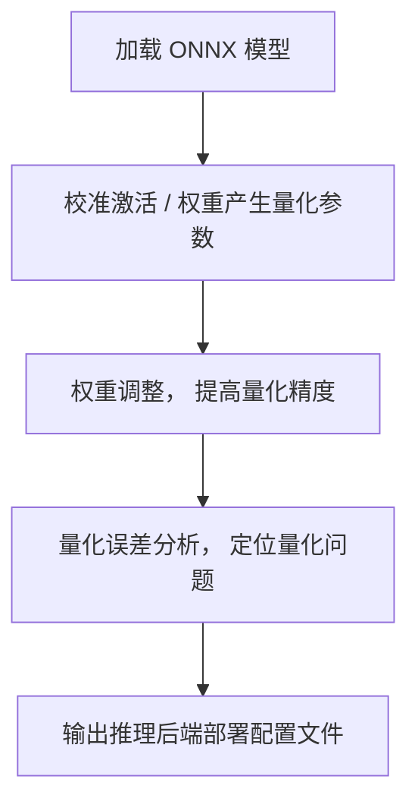

# Dipoorlet 量化工具代码结构

## 1. 引言

### 1.1 介绍 Dipoorlet 项目

#### 1.1.1 项目的背景和目标

Dipoorlet 项目是一个 跨边缘设备平台的量化工具链，主要使python 和 onnxruntime 开发。本文档旨在帮助开发者深入理解 Dipoorlet 项目的源码结构、功能模块以及设计思想。
opset = 13

#### 1.1.2 使用的编程语言和框架

## 2. 项目整体架构

### 2.1 项目模块划分

#### 2.1.1 主要模块和其功能介绍

| 文件/目录             | 说明                                       |
|-----------------------|--------------------------------------------|
| `src`                 | 核心源代码。                               |
| `tests`               | 单元测试和集成测试代码。                   |
| 配置文件              | 包含项目的配置信息（如 `.env`, `config.json`）。 |

#### 2.1.2 主要文件说明

| 文件                  | 说明                                       |
|-----------------------|--------------------------------------------|
| `deploy`              | 部署后端相关，包括如何导出每个后端的量化部署配置。 |
| `tensor_cali`         | 校准算法相关，包括 Minmax、Mse、Hist。       |
| `weight_transform`    | 权重调整算法相关，包括 DFQ (we, bc, update_bn)、AdaRound、Brecq、Qdrop。 |
| `__init__.py`         | 初始化文件。                                |
| `__main__.py`         | 主函数文件，包括了离线量化的全流程。           |
| `dist_helper.py`      | 分布式启动相关的函数。                       |
| `forward_net.py`      | 获取模型输出信息的一些函数，包括整网输出、子模型输出。 |
| `platform_settings.py`| 每个推理后端的量化配置。                     |
| `profiling.py`        | 量化误差分析。                              |
| `quantize.py`         | 量化相关的函数。                            |
| `utils.py`            | 包括自定义图结构 ONNXGraph 等。              |

#### 2.1.3 模型流程图



#### 2.1.4 项目中使用的主要第三方库和工具

## 3. 核心模块详解

- 关键模块介绍

  - 自定义数据结构onnxgraph
    - ONNXGraph 数据结构的文件树或类层次结构，列出了该数据结构中的各种属性和方法。以下是对这些内容的简要分析：
    - 类的属性
      - __init__：构造函数，通常用于初始化类的实例。
      - model：表示整体 ONNX 模型。
      - graph：表示模型的图结构，通常包含节点（operations）、输入、输出等信息。
      - output_dir：指定输出文件的目录。
      - deploy、model_type、input_map、output_map 等其他属性：这些属性通常是关于模型配置和映射的，比如模型类型、输入和输出的映射关系。
  - 主要实现的功能逻辑和算法
    - initializers：包含模型中定义的常量（即模型权重）。
    - network_inputs 和 network_outputs：代表模型的输入和输出节点。
    - tensor_name_shape_map 和 value_name_type_map：用于存储张量名称到其形状和类型的映射关系。
    - name_idx_map：用于将名字映射到索引的位置，在操作模型中很有用。
    - input 和 output：代表模型的输入和输出张量。

  - 关键函数与类的分析
    - set_names：用于设置节点、输入或输出的名称。
    - convert_constant_to_init：将常量转换为初始化器，这样可以更好地管理常量数据。
    - prepare_initializer：准备模型中的初始化器数据。
    - get_inp_oup：获取输入和输出信息。
    - get_tensor_shape 和 get_value_type：获取张量的形状和数据类型。
    - remove_node_purely 和 insert_node_purely：纯粹地移除或插入节点，可能用于不改变其他节点结构的情况下对单个节点进行操作
    - save_onnx_model：保存修改后的 ONNX 模型。
    - add_network_output 和 del_network_output：增加或删除网络的输出
    - topologize_graph：对图结构进行拓扑排序，通常用于确保计算顺序正确。
    - get_tensor_producer 和 get_tensor_consumer：获取某个张量的生产者节点和消费者节点，用于分析数据流向。
    - index：可能用于定位或索引某个节点或张量
    - del_initializer 和 set_initializer：这些方法涉及到初始化器的添加和删除，可能是对模型权重进行管理。
    - copy_from 和 update_model：这些方法可能用于将其他模型的参数或图结构复制到当前模型中，或根据需要更新模型

  - 量化处理模块
    - 在模拟量化（PTQ，Post-Training Quantization）过程中和实际在边缘设备上进行量化推理的过程中，确实存在一些差异，主要表现在以下几点：
    - 模拟量化 (Simulated Quantization)

    ```txt
    在训练或者推理模拟量化时，模型会进行以下步骤：
    量化卷积权重：先将浮点权重量化为低比特的整数（如 INT8），但同时保持浮点表示，这样可以对其进行进一步操作。
    反量化：将量化后的整数恢复到浮点形式，然后进行卷积操作。
    计算浮点卷积：使用恢复后的浮点值完成卷积运算。
    这种操作的目的是模拟真实的量化推理，在保持浮点精度的情况下评估量化对模型精度的影响。因此，它是一种为了确保量化后的模型性能不会有太大下降的手段。模拟量化过程的特点是：
    保留权重和激活的浮点信息，但引入量化和反量化操作来模拟精度损失。可以帮助优化训练流程，例如可以在量化-aware training (QAT) 中使用。
    ```

    - 实际量化推理 (Quantized Inference on Edge Devices)

    ```txt
    在边缘设备上的推理过程通常是真实的量化推理，特征是：
    直接使用量化后的整数权重和激活进行计算，不进行反量化。这意味着卷积计算和其他操作均在低比特的整数域中进行（例如 INT8 运算）。
    这种方式的优势在于计算速度更快，因为整数运算相比浮点运算更节能，并且对边缘设备更加友好，能够充分利用硬件支持的低比特运算（如向量化整数运算和专用量化硬件加速器）。
    实际量化推理的计算精度较低，但对性能和资源消耗更为有利。
    ```

    - 区别总结

    ```txt
    模拟量化主要用于在浮点环境中评估模型量化的影响，是一种分析和优化精度的手段，通过量化和反量化来模拟整数精度损失，但实际上权重仍然是浮点的。
    实际量化推理则是直接使用整数运算来加速计算过程，利用量化后的模型来实现高效低成本的推理。
    在模拟量化阶段，你可以发现精度的损失情况，从而决定是否对模型结构或量化策略进行调整。而在边缘设备上的实际量化推理中，则是以效率和低精度为代价来获得硬件推理性能的提升。
    ```

## 4. 项目流程分析

- 代码执行主流程

    ```python
    parser = argparse.ArgumentParser()
    parser.add_argument("-M", "--model", help="onnx model")
    parser.add_argument("-I", "--input_dir", help="calibration data", required=True)
    parser.add_argument("-O", "--output_dir", help="output data path")
    parser.add_argument("-N", "--data_num", help="num of calibration pics", type=int, required=True)                # 校准数据数量
    parser.add_argument("--we", help="weight euqalization", action="store_true")                                    # 权重均衡
    parser.add_argument("--bc", help="bias correction", action="store_true")
    parser.add_argument("--update_bn", help="update BN", action="store_true")                                       # 量化之后模型的bn层，减小扰动
    parser.add_argument("--adaround", help="Adaround", action="store_true")                                         # 
    parser.add_argument("--brecq", help="BrecQ", action="store_true")                                               # brecq + drop = qdrop，都是激活量化
    parser.add_argument("--drop", help="QDrop", action="store_true")
    parser.add_argument("-A", "--act_quant", help="algorithm of activation quantization",
                        choices=['minmax', 'hist', 'mse'], default='mse')
    parser.add_argument("-D", "--deploy", help="deploy platform",                                                   # 推理后端，8种后端
                        choices=['trt', 'stpu', 'magicmind', 'rv', 'atlas',
                                'snpe', 'ti', 'imx'], required=True)
    parser.add_argument("--bins", help="bins for histogram and kl", default=2048)
    parser.add_argument("--threshold", help="threshold for histogram", default=0.99999, type=float)                 # 建议使用默认即可
    parser.add_argument("--savefp", help="Save FP output of model.", action="store_true")
    parser.add_argument("--ada_bs", help="Batch size for adaround.", type=int, default=64)
    parser.add_argument("--ada_epoch", help="Epoch for adaround.", type=int, default=5000)
    parser.add_argument("--skip_layers", help="Skip layer name", default=[], type=str, nargs='+')
    parser.add_argument("--stpu_wg", help="Enable winograd for stpu.", action="store_true")
    parser.add_argument("--skip_prof_layer", help="Skip profiling by layer.", default=False, action='store_true')
    parser.add_argument("--slurm", help=" Launch task from slurm", default=False, action='store_true')
    parser.add_argument("--mpirun", help="Launch task from mpirun", default=False, action='store_true')
    parser.add_argument("--sparse", help="Sparse on/off", default=False, action="store_true")
    parser.add_argument("--sparse_rate", help="Sparse rate", type=float, default=0.5)
    parser.add_argument("--pattern", help="Sparse pattern", choices=["unstruction", "nv24"], default="unstruction")
    parser.add_argument("--optim_transformer", help="Transformer model optimization", default=False, action='store_true')  # 如果是cv模型，没有transformer的block
    parser.add_argument("--model_type", help="Transformer model type", choices=["unet"], default=None)
    parser.add_argument("--quant_format", default="QDQ", type=str, choices=["QOP", "QDQ"])
    parser.add_argument("--qnode_version", default=13, type=int, choices=[13])                                      # 量化节点的onnx opset version 默认是13
    ```

  - 项目启动过程及主函数的分析

## 4.1 forward_get_hist函数

```python
'''
description: 
param {*} onnx_graph
param {*} stats_min_max
param {*} args
return {*}
'''
def forward_get_minmax(onnx_graph, args):
    net = copy.deepcopy(onnx_graph.model)
    graph = net.graph
    for node in reversed(graph.node):
        for output_name in reversed(node.output):
            if output_name not in [_o.name for _o in graph.output]:
                graph.output.insert(0, onnx.ValueInfoProto(name=output_name))
    providers = [("CUDAExecutionProvider", {'device_id': args.local_rank})]
    ort_session = ort.InferenceSession(net.SerializeToString(), providers=providers)
    if 'CUDAExecutionProvider' not in ort_session.get_provider_options():
        logger.warning("CUDA may not used. Please check your ort/cuda/cudnn version.")
    # Start activation quantization.
    statistics = {}
    t1 = 0
    ort_inputs = {}
```

## forward_get_hist函数

```python
'''
description: 
param {*} onnx_graph
param {*} stats_min_max
param {*} args
return {*}
'''
def forward_get_hist(onnx_graph, stats_min_max, args):
    net = copy.deepcopy(onnx_graph.model)
    graph = net.graph
    for node in reversed(graph.node):
        for output_name in reversed(node.output):
            if output_name not in [_o.name for _o in graph.output]:
                graph.output.insert(0, onnx.ValueInfoProto(name=output_name))
    providers = [("CUDAExecutionProvider", {'device_id': args.local_rank})]
    ort_session = ort.InferenceSession(net.SerializeToString(), providers=providers)
    if 'CUDAExecutionProvider' not in ort_session.get_provider_options():
        logger.warning("CUDA may not used. Please check your ort/cuda/cudnn version.")
    # Start activation quantization.
    statistics = {}
    ort_inputs = {}
```

## forward_net_octav函数 mse的实现

```python
'''
description: mse 是按照下面这篇论文进行实现的：
"Optimal clipping and magnitude-aware differentiation for improved quantization-aware training"（最优截断和幅值感知微分用于改进量化感知训练）
param {*} onnx_graph
param {*} args
return {*}
'''
def forward_net_octav(onnx_graph, args):
    # Generate Graph and Net
    net = copy.deepcopy(onnx_graph.model)
    graph = net.graph
    for node in reversed(graph.node):
        for output_name in reversed(node.output):
            if output_name not in [_o.name for _o in graph.output]:
                graph.output.insert(0, onnx.ValueInfoProto(name=output_name))
    providers = [("CUDAExecutionProvider", {'device_id': args.local_rank})]
    ort_session = ort.InferenceSession(net.SerializeToString(), providers=providers)
    if 'CUDAExecutionProvider' not in ort_session.get_provider_options():
        logger.warning("CUDA may not used. Please check your ort/cuda/cudnn version.")
    # Start activation quantization.
    statistics = {}
    t1 = 0
    ort_inputs = {}
```

- 主要工作流的实现（如输入-处理-输出）
- 各模块之间的交互关系
weight_equalization 适用的是conv + conv pair这样的结构。

- 通过时序图或调用图来说明模块之间的调用关系

## 6. 错误处理与调试

- 错误处理机制

  - 常见的错误类型及其应对方式

  - 日志和异常处理的实现

  - 调试技巧

- 使用调试工具的建议（如 gdb, pdb）

- 在源码中设置断点的关键位置

## 8. 性能优化分析

- 性能瓶颈的识别

- 代码中可能存在的性能问题点

- 现有优化策略

- 优化代码的实践（如算法优化、内存管理）

- 进一步改进的建议

## 11. 参考资料

- 官方文档和链接

- 其他相关的代码分析和学习资源


ONNX 模型的结构由几个主要部分组成：

graph：模型的计算图，是模型的核心部分。
nodes：图中的运算节点，每个节点代表一个操作，例如卷积、加法、激活函数等。
input/output：图的输入和输出，定义了模型所接受和生成的张量的形状和类型。
initializer：图中参数的初始值，如权重和偏置，是静态的张量数据。
